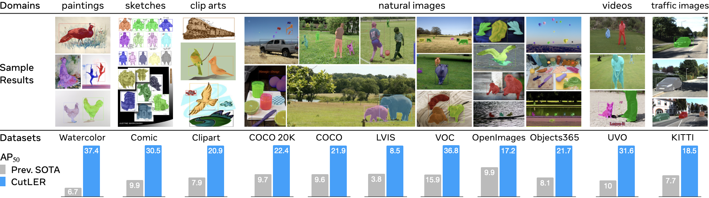
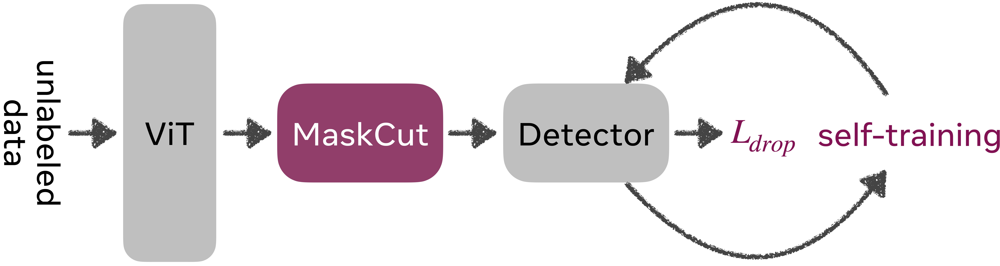
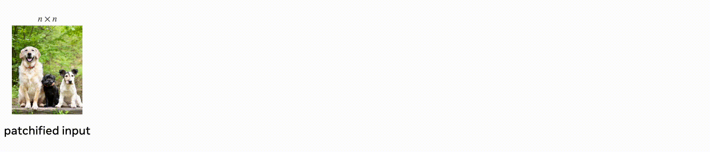
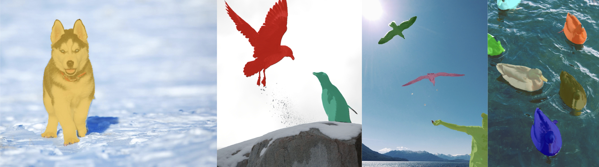
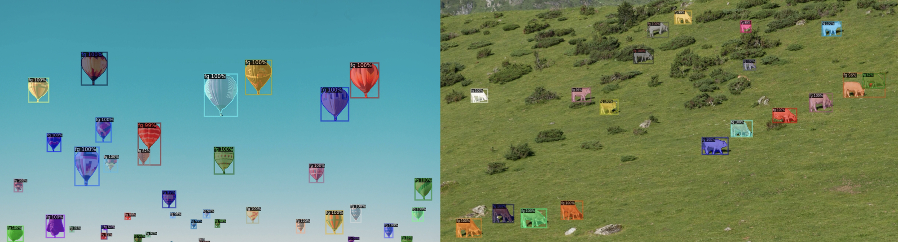

# Cut and Learn for Unsupervised Image & Video Object Detection and Instance Segmentation

**Cut**-and-**LE**a**R**n (**CutLER**) is a simple approach for training object detection and instance segmentation models without human annotations.
It outperforms previous SOTA by **2.7 times** for AP50 and **2.6 times** for AR on **11 benchmarks**.

<p align="center">  </p>

> [**Cut and Learn for Unsupervised Object Detection and Instance Segmentation**](http://people.eecs.berkeley.edu/~xdwang/projects/CutLER/)            
> [Xudong Wang](https://people.eecs.berkeley.edu/~xdwang/), [Rohit Girdhar](https://rohitgirdhar.github.io/), [Stella X. Yu](https://www1.icsi.berkeley.edu/~stellayu/), [Ishan Misra](https://imisra.github.io/)     
> FAIR, Meta AI; UC Berkeley            
> CVPR 2023            

[[`project page`](http://people.eecs.berkeley.edu/~xdwang/projects/CutLER/)] [[`arxiv`](https://arxiv.org/abs/2301.11320)] [[`colab`](https://colab.research.google.com/drive/1NgEyFHvOfuA2MZZnfNPWg1w5gSr3HOBb?usp=sharing)] [[`bibtex`](#citation)]             

Unsupervised video instance segmentation (**VideoCutLER**) is also supported. ***We demonstrate that video instance segmentation models can be learned without using any human annotations, without relying on natural videos (ImageNet data alone is sufficient), and even without motion estimations!*** The code is available [here](videocutler).             

<p align="center">
  
</p>

> [**VideoCutLER: Surprisingly Simple Unsupervised Video Instance Segmentation**](https://people.eecs.berkeley.edu/~xdwang/projects/VideoCutLER/videocutler.pdf)            
> [Xudong Wang](https://people.eecs.berkeley.edu/~xdwang/), [Ishan Misra](https://imisra.github.io/), Ziyun Zeng, [Rohit Girdhar](https://rohitgirdhar.github.io/), [Trevor Darrell](https://people.eecs.berkeley.edu/~trevor/)             
> UC Berkeley; FAIR, Meta AI            
> CVPR 2024            

[[`code`](videocutler/README.md)] [[`PDF`](https://people.eecs.berkeley.edu/~xdwang/projects/VideoCutLER/videocutler.pdf)] [[`arxiv`](https://arxiv.org/abs/2308.14710)] [[`bibtex`](#citation)]             

## Features
- We propose MaskCut approach to generate pseudo-masks for multiple objects in an image.
- CutLER can learn unsupervised object detectors and instance segmentors solely on ImageNet-1K.
- CutLER exhibits strong robustness to domain shifts when evaluated on 11 different benchmarks across domains like natural images, video frames, paintings, sketches, etc.
- CutLER can serve as a pretrained model for fully/semi-supervised detection and segmentation tasks.
- We also propose VideoCutLER, a surprisingly simple unsupervised video instance segmentation (UVIS) method without relying on optical flows. ImaegNet-1K is all we need for training a SOTA UVIS model!

## Installation
See [installation instructions](INSTALL.md).

## Dataset Preparation
See [Preparing Datasets for CutLER](datasets/README.md).

## Method Overview
<p align="center">
  
</p>
Cut-and-Learn has two stages: 1) generating pseudo-masks with MaskCut and 2) learning unsupervised detectors from pseudo-masks of unlabeled data.

### 1. MaskCut

MaskCut can be used to provide segmentation masks for multiple instances of each image.
<p align="center">
  
</p>

### MaskCut Demo

Try out the MaskCut demo using Colab (no GPU needed): [](https://colab.research.google.com/drive/1X05lKL_IBRvZB7q6n6pb4w00_tIYjGlf?usp=sharing)

Try out the web demo: [](https://huggingface.co/spaces/facebook/MaskCut) (thanks to [@hysts](https://github.com/hysts)!)


If you want to run MaskCut locally, we provide `demo.py` that is able to visualize the pseudo-masks produced by MaskCut.
Run it with:
```
cd maskcut
python demo.py --img-path imgs/demo2.jpg \
  --N 3 --tau 0.15 --vit-arch base --patch-size 8 \
  [--other-options]
```
We give a few demo images in maskcut/imgs/. If you want to run demo.py with cpu, simply add "--cpu" when running the demo script. 
For imgs/demo4.jpg, you need to use "--N 6" to segment all six instances in the image.
Following, we give some visualizations of the pseudo-masks on the demo images.
<p align="center">
  
</p>

### Generating Annotations for ImageNet-1K with MaskCut
To generate pseudo-masks for ImageNet-1K using MaskCut, first set up the ImageNet-1K dataset according to the instructions in [datasets/README.md](datasets/README.md), then execute the following command:
```
cd maskcut
python maskcut.py \
--vit-arch base --patch-size 8 \
--tau 0.15 --fixed_size 480 --N 3 \
--num-folder-per-job 1000 --job-index 0 \
--dataset-path /path/to/dataset/traindir \
--out-dir /path/to/save/annotations \
```
As the process of generating pseudo-masks for all 1.3 million images in 1,000 folders takes a significant amount of time, it is recommended to use multiple runs. Each run should process the pseudo-mask generation for a smaller number of image folders by setting "--num-folder-per-job" and "--job-index". Once all runs are completed, you can merge all the resulting json files by using the following command:
```
python merge_jsons.py \
--base-dir /path/to/save/annotations \
--num-folder-per-job 2 --fixed-size 480 \
--tau 0.15 --N 3 \
--save-path imagenet_train_fixsize480_tau0.15_N3.json
```
The "--num-folder-per-job", "--fixed-size", "--tau" and "--N" of merge_jsons.py should match the ones used to run maskcut.py.

We also provide a submitit script to launch the pseudo-mask generation process with multiple nodes. 
```
cd maskcut
bash run_maskcut_with_submitit.sh
```
After that, you can use "merge_jsons.py" to merge all these json files as described above.

### 2. CutLER

### Inference Demo for CutLER with Pre-trained Models
Try out the CutLER demo using Colab (no GPU needed): [](https://colab.research.google.com/drive/1NgEyFHvOfuA2MZZnfNPWg1w5gSr3HOBb?usp=sharing)

Try out the web demo: [](https://huggingface.co/spaces/facebook/CutLER) (thanks to [@hysts](https://github.com/hysts)!)


Try out Replicate demo and the API: [](https://replicate.com/cjwbw/cutler) 


If you want to run CutLER demos locally,
1. Pick a model and its config file from [model zoo](#model-zoo),
  for example, `model_zoo/configs/CutLER-ImageNet/cascade_mask_rcnn_R_50_FPN.yaml`.
2. We provide `demo.py` that is able to demo builtin configs. Run it with:
```
cd cutler
python demo/demo.py --config-file model_zoo/configs/CutLER-ImageNet/cascade_mask_rcnn_R_50_FPN_demo.yaml \
  --input demo/imgs/*.jpg \
  [--other-options]
  --opts MODEL.WEIGHTS /path/to/cutler_w_cascade_checkpoint
```
The configs are made for training, therefore we need to specify `MODEL.WEIGHTS` to a model from model zoo for evaluation.
This command will run the inference and show visualizations in an OpenCV window.
<!-- For details of the command line arguments, see `demo.py -h` or look at its source code
to understand its behavior. Some common arguments are: -->
* To run __on cpu__, add `MODEL.DEVICE cpu` after `--opts`.
* To save outputs to a directory (for images) or a file (for webcam or video), use `--output`.

Following, we give some visualizations of the model predictions on the demo images.
<p align="center">
  
</p>

### Unsupervised Model Learning
Before training the detector, it is necessary to use MaskCut to generate pseudo-masks for all ImageNet data.
You can either use the pre-generated json file directly by downloading it from [here](http://dl.fbaipublicfiles.com/cutler/maskcut/imagenet_train_fixsize480_tau0.15_N3.json) and placing it under "DETECTRON2_DATASETS/imagenet/annotations/", or generate your own pseudo-masks by following the instructions in [MaskCut](#1-maskcut).

We provide a script `train_net.py`, that is made to train all the configs provided in CutLER.
To train a model with "train_net.py", first setup the ImageNet-1K dataset following [datasets/README.md](datasets/README.md), then run:
```
cd cutler
export DETECTRON2_DATASETS=/path/to/DETECTRON2_DATASETS/
python train_net.py --num-gpus 8 \
  --config-file model_zoo/configs/CutLER-ImageNet/cascade_mask_rcnn_R_50_FPN.yaml
```

If you want to train a model using multiple nodes, you may need to adjust [some model parameters](https://arxiv.org/abs/1706.02677) and some SBATCH command options in "tools/train-1node.sh" and "tools/single-node_run.sh", then run:
```
cd cutler
sbatch tools/train-1node.sh \
  --config-file model_zoo/configs/CutLER-ImageNet/cascade_mask_rcnn_R_50_FPN.yaml \
  MODEL.WEIGHTS /path/to/dino/d2format/model \
  OUTPUT_DIR output/
```
You can also convert a pre-trained DINO model to detectron2's format by yourself following [this link](https://github.com/facebookresearch/moco/tree/main/detection).

### Self-training
We further improve performance by self-training the model on its predictions.

Firstly, we can get model predictions on ImageNet via running:
```
python train_net.py --num-gpus 8 \
  --config-file model_zoo/configs/CutLER-ImageNet/cascade_mask_rcnn_R_50_FPN.yaml \
  --test-dataset imagenet_train \
  --eval-only TEST.DETECTIONS_PER_IMAGE 30 \
  MODEL.WEIGHTS output/model_final.pth \ # load previous stage/round checkpoints
  OUTPUT_DIR output/ # path to save model predictions
```
Secondly, we can run the following command to generate the json file for the first round of self-training:
```
python tools/get_self_training_ann.py \
  --new-pred output/inference/coco_instances_results.json \ # load model predictions
  --prev-ann DETECTRON2_DATASETS/imagenet/annotations/imagenet_train_fixsize480_tau0.15_N3.json \ # path to the old annotation file.
  --save-path DETECTRON2_DATASETS/imagenet/annotations/cutler_imagenet1k_train_r1.json \ # path to save a new annotation file.
  --threshold 0.7
```
Finally, place "cutler_imagenet1k_train_r1.json" under "DETECTRON2_DATASETS/imagenet/annotations/", then launch the self-training process:
```
python train_net.py --num-gpus 8 \
  --config-file model_zoo/configs/CutLER-ImageNet/cascade_mask_rcnn_R_50_FPN_self_train.yaml \
  --train-dataset imagenet_train_r1 \
  MODEL.WEIGHTS output/model_final.pth \ # load previous stage/round checkpoints
  OUTPUT_DIR output/self-train-r1/ # path to save checkpoints
```

You can repeat the steps above to perform multiple rounds of self-training and adjust some arguments as needed (e.g., "--threshold" for round 1 and 2 can be set to 0.7 and 0.65, respectively; "--train-dataset" for round 1 and 2 can be set to "imagenet_train_r1" and "imagenet_train_r2", respectively; MODEL.WEIGHTS for round 1 and 2 should point to the previous stage/round checkpoints). Ensure that all annotation files are placed under DETECTRON2_DATASETS/imagenet/annotations/.
Please ensure that "--train-dataset", json file names and locations match the ones specified in "cutler/data/datasets/builtin.py".
Please refer to this [instruction](https://detectron2.readthedocs.io/en/latest/tutorials/datasets.html) for guidance on using custom datasets.

You can also directly download the MODEL.WEIGHTS and annotations used for each round of self-training:
<table><tbody>
<!-- START TABLE -->
<!-- TABLE BODY -->
<!-- ROW: round 1 -->
<tr><td align="center">round 1</td>
<td align="center"><a href="http://dl.fbaipublicfiles.com/cutler/checkpoints/cutler_cascade_r1.pth">cutler_cascade_r1.pth</a></td>
<td align="center"><a href="http://dl.fbaipublicfiles.com/cutler/maskcut/cutler_imagenet1k_train_r1.json">cutler_imagenet1k_train_r1.json</a></td>
</tr>
<!-- ROW: round 2 -->
<tr><td align="center">round 2</td>
<td align="center"><a href="http://dl.fbaipublicfiles.com/cutler/checkpoints/cutler_cascade_r2.pth">cutler_cascade_r2.pth</a></td>
<td align="center"><a href="http://dl.fbaipublicfiles.com/cutler/maskcut/cutler_imagenet1k_train_r2.json">cutler_imagenet1k_train_r2.json</a></td>
</tr>
</tbody></table>

### Unsupervised Zero-shot Evaluation
To evaluate a model's performance on 11 different datasets, please refer to [datasets/README.md](datasets/README.md) for instructions on preparing the datasets. Next, select a model from the model zoo, specify the "model_weights", "config_file" and the path to "DETECTRON2_DATASETS" in `tools/eval.sh`, then run the script.
```
bash tools/eval.sh
```

### Model Zoo
We show zero-shot unsupervised object detection performance (AP50&nbsp;|&nbsp;AR) on 11 different datasets spanning a variety of domains. ^: CutLER using Mask R-CNN as a detector; *: CutLER using Cascade Mask R-CNN as a detector. 
<table><tbody>
<!-- START TABLE -->
<!-- TABLE HEADER -->
<th valign="bottom">Methods</th>
<th valign="bottom">Models</th>
<th valign="bottom">COCO</th>
<th valign="bottom">COCO20K</th>
<th valign="bottom">VOC</th>
<th valign="bottom">LVIS</th>
<th valign="bottom">UVO</th>
<th valign="bottom">Clipart</th>
<th valign="bottom">Comic</th>
<th valign="bottom">Watercolor</th>
<th valign="bottom">KITTI</th>
<th valign="bottom">Objects365</th>
<th valign="bottom">OpenImages</th>
<!-- TABLE BODY -->
</tr>
<tr><td align="center">Prev. SOTA</td>
<td valign="bottom">-</td>
<td align="center">9.6&nbsp;|&nbsp;12.6</td>
<td align="center">9.7&nbsp;|&nbsp;12.6</td>
<td align="center">15.9&nbsp;|&nbsp;21.3</td>
<td align="center">3.8&nbsp;|&nbsp;6.4</td>
<td align="center">10.0&nbsp;|&nbsp;14.2</td>
<td align="center">7.9&nbsp;|&nbsp;15.1</td>
<td align="center">9.9&nbsp;|&nbsp;16.3</td>
<td align="center">6.7&nbsp;|&nbsp;16.2</td>
<td align="center">7.7&nbsp;|&nbsp;7.1</td>
<td align="center">8.1&nbsp;|&nbsp;10.2</td>
<td align="center">9.9&nbsp;|&nbsp;14.9</td>
</tr>
<!-- ROW: Box/Mask AP for CutLER -->
</tr>
<tr><td align="center">CutLER^</td>
<td valign="bottom"><a href="http://dl.fbaipublicfiles.com/cutler/checkpoints/cutler_mrcnn_final.pth">download</a></td>
<td align="center">21.1&nbsp;|&nbsp;29.6</td>
<td align="center">21.6&nbsp;|&nbsp;30.0</td>
<td align="center">36.6&nbsp;|&nbsp;41.0</td>
<td align="center">7.7&nbsp;|&nbsp;18.7</td>
<td align="center">29.8&nbsp;|&nbsp;38.4</td>
<td align="center">20.9&nbsp;|&nbsp;38.5</td>
<td align="center">31.2&nbsp;|&nbsp;37.1</td>
<td align="center">37.3&nbsp;|&nbsp;39.9</td>
<td align="center">15.3&nbsp;|&nbsp;25.4</td>
<td align="center">19.5&nbsp;|&nbsp;30.0</td>
<td align="center">17.1&nbsp;|&nbsp;26.4</td>
</tr>
<!-- ROW: Box/Mask AP for CutLER -->
</tr>
<tr><td align="center">CutLER*</td>
<td valign="bottom"><a href="http://dl.fbaipublicfiles.com/cutler/checkpoints/cutler_cascade_final.pth">download</a></td>
<td align="center">21.9&nbsp;|&nbsp;32.7</td>
<td align="center">22.4&nbsp;|&nbsp;33.1</td>
<td align="center">36.9&nbsp;|&nbsp;44.3</td>
<td align="center">8.4&nbsp;|&nbsp;21.8</td>
<td align="center">31.7&nbsp;|&nbsp;42.8</td>
<td align="center">21.1&nbsp;|&nbsp;41.3</td>
<td align="center">30.4&nbsp;|&nbsp;38.6</td>
<td align="center">37.5&nbsp;|&nbsp;44.6</td>
<td align="center">18.4&nbsp;|&nbsp;27.5</td>
<td align="center">21.6&nbsp;|&nbsp;34.2</td>
<td align="center">17.3&nbsp;|&nbsp;29.6</td>
</tr>
</tbody></table>

## Semi-supervised and Fully-supervised Learning
CutLER can also serve as a pretrained model for training fully supervised object detection and instance segmentation models and improves performance on COCO, including on few-shot benchmarks.

### Training & Evaluation in Command Line
You can find all the semi-supervised and fully-supervised learning configs provided in CutLER under `model_zoo/configs/COCO-Semisupervised`.

To train a model using K% labels with `train_net.py`, first set up the COCO dataset according to [datasets/README.md](datasets/README.md) and specify K value in the config file, then run:
```
python train_net.py --num-gpus 8 \
  --config-file model_zoo/configs/COCO-Semisupervised/cascade_mask_rcnn_R_50_FPN_{K}perc.yaml \
  MODEL.WEIGHTS /path/to/cutler_pretrained_model
```

You can find all config files used to train supervised models under `model_zoo/configs/COCO-Semisupervised`.
The configs are made for 8-GPU training. To train on 1 GPU, you may need to [change some parameters](https://arxiv.org/abs/1706.02677), e.g. number of GPUs (num-gpus your_num_gpus), learning rates (SOLVER.BASE_LR your_base_lr) and batch size (SOLVER.IMS_PER_BATCH your_batch_size).

### Evaluation
To evaluate a model's performance, use
```
python train_net.py \
  --config-file model_zoo/configs/COCO-Semisupervised/cascade_mask_rcnn_R_50_FPN_{K}perc.yaml \
  --eval-only MODEL.WEIGHTS /path/to/checkpoint_file
```
For more options, see `python train_net.py -h`.

### Model Zoo
We fine-tune a Cascade R-CNN model initialized with CutLER or MoCo-v2 on varying amounts of labeled COCO data, and show results (Box&nbsp;|&nbsp;Mask AP) on the val2017 split below:

<table><tbody>
<!-- START TABLE -->
<!-- TABLE HEADER -->
<th valign="bottom">% of labels</th>
<th valign="bottom">1%</th>
<th valign="bottom">2%</th>
<th valign="bottom">5%</th>
<th valign="bottom">10%</th>
<th valign="bottom">20%</th>
<th valign="bottom">30%</th>
<th valign="bottom">40%</th>
<th valign="bottom">50%</th>
<th valign="bottom">60%</th>
<th valign="bottom">80%</th>
<th valign="bottom">100%</th>
<!-- TABLE BODY -->
<!-- ROW: Box/Mask AP for CutLER -->
<tr><td align="center">MoCo-v2</td>
<td align="center">11.8&nbsp;|&nbsp;10.0</td>
<td align="center">16.2&nbsp;|&nbsp;13.8</td>
<td align="center">20.5&nbsp;|&nbsp;17.8</td>
<td align="center">26.5&nbsp;|&nbsp;23.0</td>
<td align="center">32.5&nbsp;|&nbsp;28.2</td>
<td align="center">35.5&nbsp;|&nbsp;30.8</td>
<td align="center">37.3&nbsp;|&nbsp;32.3</td>
<td align="center">38.7&nbsp;|&nbsp;33.6</td>
<td align="center">39.9&nbsp;|&nbsp;34.6</td>
<td align="center">41.6&nbsp;|&nbsp;36.0</td>
<td align="center">42.8&nbsp;|&nbsp;37.0</td>
</tr>
<!-- ROW: Mask AP -->
<tr><td align="center">CutLER</td>
<td align="center">16.8&nbsp;|&nbsp;14.6</td>
<td align="center">21.6&nbsp;|&nbsp;18.9</td>
<td align="center">27.8&nbsp;|&nbsp;24.3</td>
<td align="center">32.2&nbsp;|&nbsp;28.1</td>
<td align="center">36.6&nbsp;|&nbsp;31.7</td>
<td align="center">38.2&nbsp;|&nbsp;33.3</td>
<td align="center">39.9&nbsp;|&nbsp;34.7</td>
<td align="center">41.5&nbsp;|&nbsp;35.9</td>
<td align="center">42.3&nbsp;|&nbsp;36.7</td>
<td align="center">43.8&nbsp;|&nbsp;37.9</td>
<td align="center">44.7&nbsp;|&nbsp;38.5</td>
</tr>
<!-- ROW: Model Downloads -->
<tr><td align="center">Download</td>
<td align="center"><a href="http://dl.fbaipublicfiles.com/cutler/checkpoints/cutler_semi_1perc.pth">model</a></td>
<td align="center"><a href="http://dl.fbaipublicfiles.com/cutler/checkpoints/cutler_semi_2perc.pth">model</a></td>
<td align="center"><a href="http://dl.fbaipublicfiles.com/cutler/checkpoints/cutler_semi_5perc.pth">model</a></td>
<td align="center"><a href="http://dl.fbaipublicfiles.com/cutler/checkpoints/cutler_semi_10perc.pth">model</a></td>
<td align="center"><a href="http://dl.fbaipublicfiles.com/cutler/checkpoints/cutler_semi_20perc.pth">model</a></td>
<td align="center"><a href="http://dl.fbaipublicfiles.com/cutler/checkpoints/cutler_semi_30perc.pth">model</a></td>
<td align="center"><a href="http://dl.fbaipublicfiles.com/cutler/checkpoints/cutler_semi_40perc.pth">model</a></td>
<td align="center"><a href="http://dl.fbaipublicfiles.com/cutler/checkpoints/cutler_semi_50perc.pth">model</a></td>
<td align="center"><a href="http://dl.fbaipublicfiles.com/cutler/checkpoints/cutler_semi_60perc.pth">model</a></td>
<td align="center"><a href="http://dl.fbaipublicfiles.com/cutler/checkpoints/cutler_semi_80perc.pth">model</a></td>
<td align="center"><a href="http://dl.fbaipublicfiles.com/cutler/checkpoints/cutler_fully_100perc.pth">model</a></td>
</tr>
</tbody></table>

Both MoCo-v2 and our CutLER are trained for the 1x schedule using Detectron2, except for extremely low-shot settings with 1% or 2% labels. When training with 1% or 2% labels, we train both MoCo-v2 and our model for 3,600 iterations with a batch size of 16.

## License
The majority of CutLER, Detectron2 and DINO are licensed under the [CC-BY-NC license](LICENSE), however portions of the project are available under separate license terms: TokenCut, Bilateral Solver and CRF are licensed under the MIT license; If you later add other third party code, please keep this license info updated, and please let us know if that component is licensed under something other than CC-BY-NC, MIT, or CC0.

## Ethical Considerations
CutLER's wide range of detection capabilities may introduce similar challenges to many other visual recognition methods.
As the image can contain arbitrary instances, it may impact the model output.

## How to get support from us?
If you have any general questions, feel free to email us at [Xudong Wang](mailto:xdwang@eecs.berkeley.edu), [Ishan Misra](mailto:imisra@meta.com) and [Rohit Girdhar](mailto:rgirdhar@meta.com). If you have code or implementation-related questions, please feel free to send emails to us or open an issue in this codebase (We recommend that you open an issue in this codebase, because your questions may help others). 

## Citation
If you find our work inspiring or use our codebase in your research, please consider giving a star ⭐ and a citation.
```
@inproceedings{wang2023cut,
  title={Cut and learn for unsupervised object detection and instance segmentation},
  author={Wang, Xudong and Girdhar, Rohit and Yu, Stella X and Misra, Ishan},
  booktitle={Proceedings of the IEEE/CVF Conference on Computer Vision and Pattern Recognition},
  pages={3124--3134},
  year={2023}
}
```

```
@article{wang2023videocutler,
  title={VideoCutLER: Surprisingly Simple Unsupervised Video Instance Segmentation},
  author={Wang, Xudong and Misra, Ishan and Zeng, Ziyun and Girdhar, Rohit and Darrell, Trevor},
  journal={arXiv preprint arXiv:2308.14710},
  year={2023}
}
```
